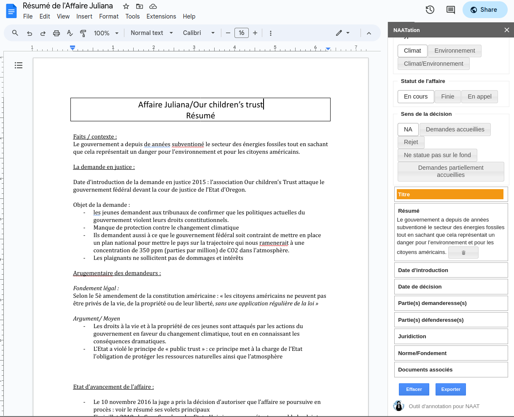

# Annotation Tool for NAAT organization (NAATation)

NAATation is a free Google Doc™ add-on that helps annotate climate/environmental litigation summaries on Google Doc™.

## Overview

This add-on enables NAAT's volunteers to structure the information inside textual summaries of the climate trials.

With `NAATation` you can:
* select a piece of text
* annotate it by clicking on the desired attribute in the add-on's sidebar
* export the annotations in a given spreadsheet

## Permissions

When you install `NAATation`, you are asked to accept the following authorizations:
* see your primary Google Account email address (https://www.googleapis.com/auth/userinfo.email)
* see your personal info, including any personal info you've made publicly available (https://www.googleapis.com/auth/userinfo.profile)
* see, edit, create, and delete all your Google Docs documents (https://www.googleapis.com/auth/documents)
* permission to create a sidebar (https://www.googleapis.com/auth/script.container.ui)
* see, edit, create, and delete all your Google Sheets spreadsheets (https://www.googleapis.com/auth/spreadsheets)

Why does `NAATation` need those access scopes?
* **Google Docs**: I will need read/write access to Google Docs documents in order to add properties to the document so that my app can save the annotated content. A narrower scope would not be sufficient because I wouldn't be able to save textual annotations to the document of interest.
* **Google Sheets**: I will need read/write access to Google Sheets documents in order to append and modify rows within an aggregation file so that my app can export the textual annotations from the Google Doc to one specific Google Sheet document. A narrower scope would not be sufficient because I wouldn't be able to gather the textual annotations into one Google Sheet document.
* **Sidebars**: to open `NAATation` as a sidebar in your Google applications

## Installation and other details

* Installation: [Install NAATation](https://workspace.google.com/marketplace/app/naatation/879669756842) from the Google Workspace Marketplace.
* License: `NAATation` uses the [Apache 2.0 license](https://github.com/ClementBM/naatation/blob/master/LICENSE).
* Documentation: See TODO for more information about features and usage.
* [Privacy policy](https://clementbm.github.io/naatation/#terms-and-conditions).

## Contributing

If you want to contribute docs or code to this project, please read [CONTRIBUTING.md](CONTRIBUTING.md) and [dev.md](dev.md).

## Contributors

* [ClementBM](https://github.com/ClementBM)
